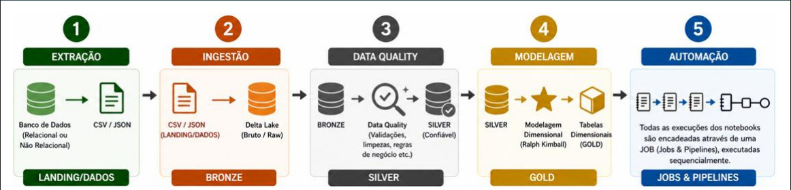

# Lakehouse com Databricks – Arquitetura Medalhão

**Trabalho 3 – Engenharia de Dados**  
Pipeline de dados implementando a **Arquitetura Medalhão** (Landing → Bronze → Silver → Gold) no Databricks Free Edition com Delta Lake e Jobs & Pipelines.

---

## Domínio dos Dados

Despesas Parlamentares do CEAP (Cota para o Exercício da Atividade Parlamentar) da Câmara dos Deputados Federal do Brasil. O dataset contém 5 tabelas relacionais:

| Tabela | Registros | Descrição |
|--------|-----------|-----------|
| partidos | 12 | Partidos políticos |
| parlamentares | 25 | Deputados federais (57ª Legislatura) |
| categorias_despesa | 8 | Tipos de despesa CEAP |
| fornecedores | 20 | Empresas/pessoas que prestaram serviços |
| despesas | 30 | Registros de reembolso (tabela fato) |

---

## Arquitetura Medalhão



---

## Modelo Dimensional (Gold – Star Schema)

```
         dim_tempo
              │
dim_parlamentar ──── fato_despesas ──── dim_categoria_despesa
                           │
                    dim_fornecedor
```

**Dimensões:**
- `dim_tempo` – data de emissão decomposta (ano, trimestre, mês, dia, semana)
- `dim_parlamentar` – deputado com partido desnormalizado
- `dim_partido` – partido político
- `dim_categoria_despesa` – tipo de despesa CEAP
- `dim_fornecedor` – empresa ou pessoa física que prestou o serviço

**Fato:**
- `fato_despesas` – `vl_documento`, `vl_glosa`, `vl_liquido`

---

## Estrutura do Repositório

```
databricks-medallion-parlamentar/
├── notebook/
│   ├── 00_landing.py    # Extração → Landing Zone (CSV)
│   ├── 01_bronze.py     # Landing → Bronze (Delta Lake)
│   ├── 02_silver.py     # Bronze → Silver (Data Quality)
│   └── 03_gold.py       # Silver → Gold (Star Schema)
├── docs/
│   ├── index.md
│   ├── arquitetura.md
│   └── camadas.md
├── mkdocs.yml
└── README.md
```

---

## Tecnologias

- **Databricks Free Edition** – plataforma de processamento
- **Apache Spark** – motor de processamento distribuído
- **Delta Lake** – formato de armazenamento ACID
- **Python / PySpark** – linguagem dos notebooks
- **Jobs & Pipelines** – orquestração sequencial dos notebooks

---

## Como Executar no Databricks

1. Importe os notebooks em `Workspace > Import`
2. Crie um cluster (Single Node, DBR 13.x+)
3. Crie um Job com 4 tasks na ordem: `00 → 01 → 02 → 03`
4. Execute o Job

Consulte a [documentação completa](docs/index.md) para o passo a passo detalhado.
